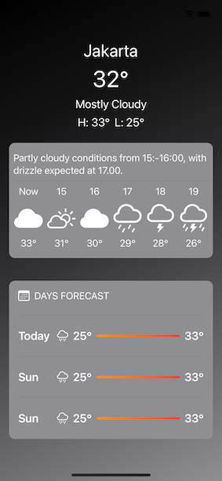

##Overview
This SwiftUI project showcases a sleek and visually appealing weather app. Leveraging SwiftUI's powerful layout views, including VStack, HStack, and ZStack, the app delivers a modern and immersive user experience.

##Screenshots


##Getting Started

To explore and run the project locally, follow these steps:

1. Clone the repository to your local machine:
```swift
git clone https://github.com/your-username/weather-app-swiftui.git
```
2. Open the project in Xcode.
3. Build and run the app on the simulator or a physical device.

##Features
- [x] Dynamic Weather Information: Display current weather conditions, temperature, and a brief description.
- [x] Hourly Forecast: Visualize hourly weather updates with icons and temperatures.
- [x] Daily Forecast: Plan ahead with a concise daily weather overview.
- [x] Visual Appeal: Utilize gradients, colors, and custom components for an engaging UI.

##Code Structure
The project's code is organized as follows:

ContentView.swift: The main SwiftUI view containing the app's layout structure.
BackgroundView.swift: Creates a gradient background using LinearGradient.
WeatherTimeView.swift: Defines a custom view for displaying hourly weather information.
WeatherForecastView.swift: Custom view for presenting daily weather forecast details.

##Custom Components
WeatherTimeView: Displays the hour, weather icon, and temperature for hourly forecasts.
WeatherForecastView: Presents the day, weather icon, and temperature range for daily forecasts.

##SwiftUI Stacks
ZStack: Provides depth by overlaying background and other views.
VStack: Organizes vertical elements such as text, temperatures, and forecast details.
HStack: Displays high and low temperatures side by side.

##Contribution Guidelines
Feel free to contribute to this project by submitting pull requests, reporting issues, or suggesting improvements. Your contributions are highly valued!

Enjoy exploring and enhancing the Weather App SwiftUI project! If you have any questions or suggestions, feel free to reach out. Happy coding!